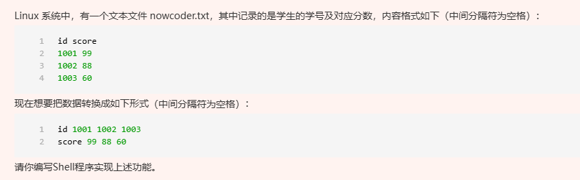

```shell

#!/bin/bash

# 假设数据存储在data.txt文件中，你可以根据实际情况修改文件名
input_file="data.txt"

# 使用awk进行数据处理
awk '
BEGIN {
    printf "id "
    printf "score "
}
{
    printf $1 " "
    printf $2 " "
}
END {
    print ""
}' $input_file

```