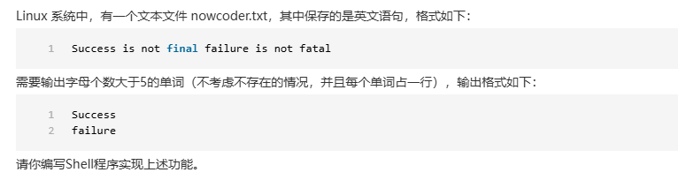
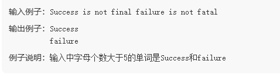
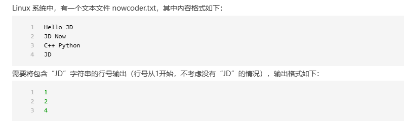

```shell
tr ' ' '\n' < nowcoder.txt | grep -E '^.{6,}$'
```

```shell
awk '{for(i=1; i<=NF; i++) if(length($i)>5) print $i}' nowcoder.txt
```



```shell
grep -n "JD" nowcoder.txt | cut -d: -f1
```

```shell
awk '/JD/{print NR}' nowcoder.txt
```